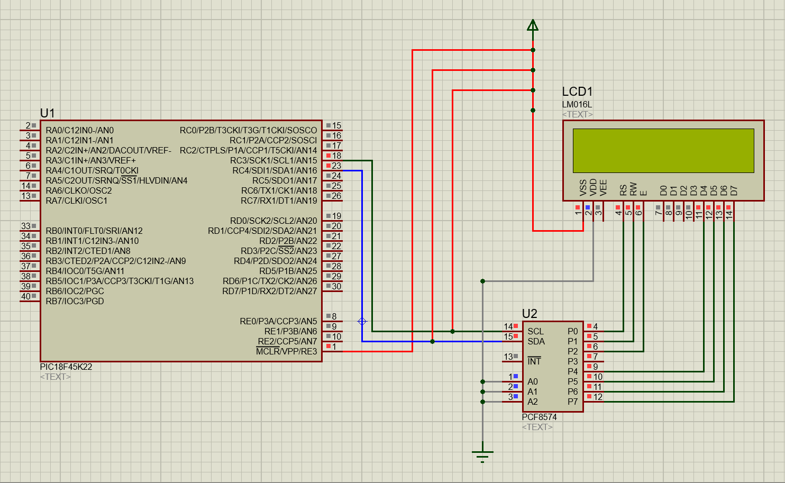

[](https://classroom.github.com/a/rb0M7Pn8)
[](https://classroom.github.com/online_ide?assignment_repo_id=23818181&assignment_repo_type=AssignmentRepo)
# Lab07: Visualización en LCD 16x2 usando módulo I²C con microcontrolador PIC

## Integrantes

* [Santiago Leonardo Molina Bogotá](https://github.com/SaintGao-cmd)

* [Hellen Julieth Rincón Orjuela](https://github.com/hellenjurinconor-crypto)

* [Miguel Angel Tarazona Peinado](https://github.com/miguetarazona) 

## Documentación

# I2C LCD Driver para PIC18

Driver en C para controlar una pantalla LCD 16x2 mediante el protocolo I2C, usando el módulo MSSP de microcontroladores PIC18 (compilado con XC8). Incluye una demo animada de cuenta regresiva con caracteres personalizados.

---

## Estructura del proyecto

```
├── I2C.h           # Definiciones de pines y prototipos del bus I2C
├── I2C.c           # Implementación del protocolo I2C (modo maestro)
├── I2C_LCD.h       # Definiciones de la LCD y prototipos de alto nivel
├── I2C_LCD.c       # Comandos y escritura sobre la LCD vía I2C
└── main_I2C.c      # Aplicación demo: animación bomba → explosión
```

---

## Hardware

| Señal | Pin PIC | Registro |
|-------|---------|----------|
| SCL   | RC3     | `TRISCbits.TRISC3` / `ANSELCbits.ANSC3` |
| SDA   | RC4     | `TRISCbits.TRISC4` / `ANSELCbits.ANSC4` |

- **LCD**: módulo 16x2 con adaptador I2C (PCF8574)
- **Dirección I2C de la LCD**: `0x4E` (configurable en `I2C_LCD.h`)
- **Frecuencia de CPU**: 16 MHz (oscilador interno, ajustable en `main_I2C.c`)

---

## Módulos

### `I2C.h` / `I2C.c` — Capa de transporte I2C

Configura el módulo MSSP del PIC en modo I2C Maestro y expone tres primitivas básicas:

```c
void I2C_init(void);                    // Inicializa MSSP (modo maestro)
void I2C_start(void);                   // Genera condición START
void I2C_stop(void);                    // Genera condición STOP
void I2C_write(unsigned char data);     // Transmite un byte y espera ACK
```

**Detalles de configuración:**
- `SSPSTAT = 0x80` → habilita modo de entrada estándar
- `SSPCON1 = 0x28` → activa MSSP en modo I2C Maestro
- Los pines RC3/RC4 se configuran como entradas digitales (open-drain requerido por I2C)

---

### `I2C_LCD.h` / `I2C_LCD.c` — Capa de abstracción LCD

Implementa el protocolo de la LCD HD44780 en modo 4 bits, enviando los nibbles alto y bajo de cada byte a través del expansor I2C. Cada transferencia sigue la secuencia:

```
START → dirección LCD → nibble alto (E=1) → nibble alto (E=0)
                      → nibble bajo (E=1) → nibble bajo (E=0) → STOP
```

El pin **Enable (E)** se controla con los bits `0x0C` (E=1) y `0x08` (E=0). El bit **RS** diferencia comandos (`0x0C/0x08`) de datos (`0x0D/0x09`).

#### API disponible

```c
void lcd_init(void);                                    // Secuencia de inicialización HD44780
void lcd_cmd(unsigned char cmd);                        // Envía un comando a la LCD
void lcd_write_char(char c);                            // Escribe un carácter en la posición actual
void lcd_write_string(const char *str);                 // Escribe una cadena (termina en '\0')
void lcd_set_cursor(unsigned char row, unsigned char col); // Posiciona el cursor (fila 0 o 1)
void lcd_clear(void);                                   // Borra la pantalla (cmd 0x01)
```

#### Secuencia de inicialización (`lcd_init`)

```
Espera 20 ms → 0x33 → 0x32 → 0x28 (4 bits, 2 líneas, 5x8)
→ 0x0C (display ON, cursor OFF) → 0x06 (autoincremento) → 0x01 (clear)
```

---

### `main_I2C.c` — Aplicación demo

Demuestra el uso de la capa LCD con una animación en tres fases:

#### Caracteres personalizados (CGRAM)

Se definen dos glifos de 5×8 píxeles cargados en la memoria CGRAM de la LCD:

| Slot | Nombre     | Descripción |
|------|-----------|-------------|
| 1    | `bomba`   | Ícono de bomba (8 filas de bits) |
| 2    | `explosion` | Ícono de estrella/explosión |

```c
void lcd_create_char(unsigned char location, unsigned char map[]);
```
Apunta a `0x40 + (location * 8)` en CGRAM, escribe las 8 filas del mapa y regresa a DDRAM con `0x80`.

#### Fases de la animación

```
┌─────────────────────────────────────────────────────┐
│ Fase 1: La bomba se desliza de columna 15 → 0       │
│         (fila superior, 200 ms por columna)         │
├─────────────────────────────────────────────────────┤
│ Fase 2: Cuenta regresiva  3... → 2... → 1...        │
│         (fila inferior, 600 ms por número)          │
├─────────────────────────────────────────────────────┤
│ Fase 3: Explosión parpadeante ×5                    │
│         "BOOM!!!" en fila inferior (200/150 ms)     │
└─────────────────────────────────────────────────────┘
```

---

## Configuración de fuses (PIC18)

```c
#pragma config FOSC     = INTIO67   // Oscilador interno, RA6/RA7 como GPIO
#pragma config PLLCFG   = OFF
#pragma config PRICLKEN = ON
#pragma config WDTEN    = OFF       // Watchdog desactivado
#pragma config PWRTEN   = OFF
#pragma config BOREN    = OFF
#pragma config MCLRE    = EXTMCLR   // MCLR externo habilitado
#pragma config PBADEN   = OFF
#pragma config LVP      = OFF       // Sin programación de bajo voltaje
```

---

## Personalización rápida

| Qué cambiar | Dónde |
|-------------|-------|
| Dirección I2C de la LCD | `#define ADDRESS_LCD` en `I2C_LCD.h` |
| Frecuencia del oscilador | `_XTAL_FREQ` en `I2C_LCD.h` y `main_I2C.c` |
| Pines SCL/SDA | `TRIS_SCL`, `TRIS_SDA`, `ANSEL_*` en `I2C.h` |
| Velocidad de animación | `__delay_ms()` en `main_I2C.c` |
| Glifos personalizados | Arrays `bomba[]` / `explosion[]` en `main_I2C.c` |

## Diagramas



## Evidencias de implementación

## Preguntas

**1. ¿Por qué I²C se clasifica como half-duplex mientras que SPI es full-duplex? ¿Qué implicación práctica tiene esa diferencia para el control de una LCD?**
 
I²C es half-duplex porque utiliza las mismas líneas (SDA y SCL) para enviar y recibir datos, pero no puede hacerlo al mismo tiempo, solo en un sentido por vez. En cambio, SPI es full-duplex porque tiene líneas separadas para transmisión y recepción, permitiendo comunicación simultánea. En el caso de una LCD, esto significa que con I²C se ahorran pines del microcontrolador, pero la comunicación es un poco más lenta; mientras que SPI sería más rápido, pero consumiría más pines.
 
---
 
**2. En `I2C_init()` se asigna `SSPCON1 = 0x28`. Desglose ese valor bit a bit e identifique qué modo de operación del MSSP se está seleccionando y por qué se elige ese valor.**
 
`SSPCON1 = 0x28` en binario es `0010 1000`. Esto indica que el módulo MSSP está configurado en modo I²C Master (bits `SSPM3:SSPM0 = 1000`) y además se habilita el módulo serial síncrono (`SSPEN = 1`). Este valor se utiliza porque permite al microcontrolador actuar como maestro en el bus I²C y generar las señales de reloj necesarias para la comunicación.
 
---
 
**3. Las funciones `I2C_start()`, `I2C_stop()` e `I2C_write()` comparten el mismo patrón: activar un bit de control y luego esperar con `while(!PIR1bits.SSPIF)`. ¿Qué representa la bandera `SSPIF` y por qué se limpia después de cada operación?**
 
La bandera `SSPIF` (SSP Interrupt Flag) indica que el módulo MSSP ha terminado una operación, como enviar un dato o generar START/STOP. Se usa `while(!SSPIF)` para esperar a que la operación termine correctamente antes de continuar. Luego se limpia la bandera porque si no se borra, el sistema podría interpretar que aún hay una interrupción pendiente y generar errores en la siguiente comunicación.
 
---
 
**4. El fuse `PBADEN = OFF` está presente en la configuración. ¿Qué efecto tendría dejarlo en `ON` sobre los pines del puerto B, y por qué podría causar problemas si se usan esos pines como salidas digitales?**
 
`PBADEN = OFF` hace que los pines del puerto B se configuren como digitales desde el inicio del microcontrolador. Si estuviera en `ON`, algunos pines de PORTB iniciarían como entradas analógicas, lo que puede causar que no funcionen correctamente como entradas o salidas digitales hasta que se reconfiguren manualmente, generando errores en el control de dispositivos conectados.
 
---
 
**5. Compare el control de la LCD en modo paralelo (lab04) con el modo I²C de este laboratorio. Mencione ventajas y desventajas de cada enfoque en términos de: cantidad de pines usados, velocidad de actualización y complejidad del código.**
 
| Criterio | Modo paralelo | Modo I²C |
|----------|--------------|----------|
| Pines usados | 6 a 10 pines | 2 pines (SDA y SCL) |
| Velocidad | Mayor, comunicación directa | Menor, depende del protocolo serial |
| Complejidad del código | Menor, acceso directo a pines | Mayor, requiere capas de abstracción |
 
En el modo paralelo se consume más hardware pero la comunicación es más rápida y directa. En I²C se libera la mayoría de los pines del microcontrolador a costa de una velocidad ligeramente menor y un código más estructurado.
 
---
 
**6. El bus I²C permite conectar múltiples esclavos con solo dos hilos. Si se quisiera agregar un segundo módulo PCF8574 al mismo bus (por ejemplo, para controlar un segundo LCD), ¿qué cambio mínimo sería necesario en el hardware y en el código?**
 
No se necesitan cambios en el cableado principal, ya que ambos módulos comparten las mismas líneas SDA y SCL. El cambio necesario es:
 
- **Hardware:** ajustar los pines `A0`, `A1` y `A2` del segundo PCF8574 para asignarle una dirección I²C distinta a la del primero.
- **Código:** definir una segunda dirección (por ejemplo `#define ADDRESS_LCD2 0x4C`) y usarla al llamar a `I2C_write()` para dirigir los comandos al dispositivo correcto.

## Conclusiones

En este proyecto se logró implementar correctamente la comunicación I2C en el microcontrolador PIC, permitiendo la conexión con dispositivos externos como una pantalla LCD utilizando solo dos líneas de comunicación (SDA y SCL). Se comprobó que la configuración del módulo MSSP es fundamental para el funcionamiento del sistema, ya que parámetros como el modo maestro y la velocidad de comunicación determinan la correcta transmisión de datos entre dispositivos.

El uso de I2C facilitó el diseño del sistema al reducir la cantidad de pines necesarios en el microcontrolador en comparación con el modo paralelo, optimizando así el uso del hardware, aunque con una velocidad de comunicación un poco más baja. También se evidenció la importancia de la sincronización mediante la bandera SSPIF, ya que garantiza que cada operación de envío, inicio o parada de comunicación se complete correctamente antes de continuar con la siguiente instrucción.


## Referencias

* **[1]** Microchip Technology Inc., "PIC18(L)F2X/4XK22 Data Sheet," Chandler, AZ, USA, Doc. Pages 241-260, 2010.
* **[2]** NXP Semiconductors, "PCF8574; PCF8574A Remote 8-bit I/O expander for I2C-bus," Eindhoven, The Netherlands, Rev. 5, 2013.
* **[3]** NXP Semiconductors, "UM10204: I2C-bus specification and user manual," Rev. 7.0, 2021.
* **[4]** M. A. Mazidi, R. D. McKinlay y D. Causey, *PIC Microcontroller and Embedded Systems: Using Assembly and C for PIC18*, 1.ª ed. Paramus, NJ, USA: Prentice Hall, 2007.