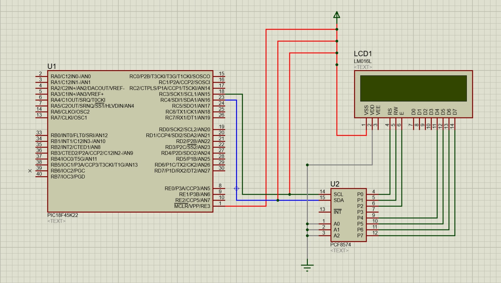

# Lab07: Visualización en LCD 16x2 usando módulo I²C con microcontrolador PIC

## Integrantes
# Miguel Angel Tarazona 

# Helen Rincon 

# Santiago Molina 

## Documentación

#include "i2c.h"
// Incluye la librería personalizada para manejar la comunicación I2C.
// Contiene definiciones y funciones del protocolo I2C.

void I2C_init(void)
// Función que inicializa el módulo I2C.
{
    TRIS_SCL = 1;
    // Configura el pin SCL como entrada.

    TRIS_SDA = 1;
    // Configura el pin SDA como entrada.
    
    ANSEL_SCL = 0;
    // Desactiva la función analógica del pin SCL (RC3).

    ANSEL_SDA = 0;
    // Desactiva la función analógica del pin SDA (RC4).
    
    SSPSTAT = 0x80;
    // Configura el registro SSPSTAT.
    // Desactiva el Slew Rate para modo estándar I2C.

    SSPCON1 = 0x28;
    // Configura el módulo MSSP en modo I2C Maestro.

    SSPCON2 = 0x00;
    // Limpia configuraciones adicionales del módulo I2C.

    SSPCON1bits.SSPEN = 1;
    // Habilita el módulo I2C.
}

void I2C_start(void)
// Función que genera la condición START del protocolo I2C.
{
    SSPCON2bits.SEN = 1;
    // Genera la señal de inicio START.

    while(!PIR1bits.SSPIF);
    // Espera hasta que termine la operación.

    PIR1bits.SSPIF = 0;
    // Limpia la bandera de interrupción.
}

void I2C_stop(void)
// Función que genera la condición STOP del protocolo I2C.
{
    SSPCON2bits.PEN = 1;
    // Genera la señal de parada STOP.

    while(!PIR1bits.SSPIF);
    // Espera hasta que termine la operación.

    PIR1bits.SSPIF = 0;
    // Limpia la bandera de interrupción.
}

void I2C_write(unsigned char data)
// Función que envía un dato por comunicación I2C.
{
    SSPBUF = data;
    // Coloca el dato en el buffer de transmisión.

    while(!PIR1bits.SSPIF);
    // Espera hasta que la transmisión termine.

    PIR1bits.SSPIF = 0;
    // Limpia la bandera de interrupción.
}

/*
Este código configura la comunicación I2C en un microcontrolador PIC utilizando el módulo MSSP en modo maestro. 
Primero se configuran los pines SCL y SDA y se desactiva su función analógica para trabajar en modo digital. 
Luego se inicializa el módulo I2C mediante los registros SSPSTAT, SSPCON1 y SSPCON2. 

Además, el programa incluye funciones para generar la condición de inicio (START), la condición de parada (STOP) y para enviar datos seriales mediante el protocolo I2C. 
Este código permite la comunicación entre el microcontrolador y dispositivos externos como sensores, pantallas LCD o memorias EEPROM.
*/

#ifndef I2C_H
#define I2C_H

#include <xc.h>

#define ANSEL_SCL ANSELCbits.ANSC3
#define ANSEL_SDA ANSELCbits.ANSC4

#define TRIS_SCL TRISCbits.TRISC3
#define TRIS_SDA TRISCbits.TRISC4

void I2C_init(void);
void I2C_start(void);
void I2C_stop(void);
void I2C_write(unsigned char data);

#endif

/*
Este archivo de cabecera define las configuraciones y funciones necesarias para utilizar la comunicación I2C en un microcontrolador PIC. 
Primero se utilizan las directivas #ifndef, #define y #endif para evitar múltiples inclusiones del archivo durante la compilación.

Luego se incluye la librería <xc.h>, que permite acceder a los registros internos y configuraciones del microcontrolador.

Las macros ANSEL_SCL y ANSEL_SDA permiten controlar la función analógica o digital de los pines SCL y SDA utilizados en la comunicación I2C. 
Asimismo, las macros TRIS_SCL y TRIS_SDA permiten configurar dichos pines como entradas o salidas.

Posteriormente se declaran las funciones I2C_init() para inicializar el módulo I2C, I2C_start() para generar la condición de inicio, I2C_stop() para finalizar la comunicación e I2C_write() para enviar datos mediante el protocolo I2C.

Este archivo facilita la organización y el manejo de la comunicación I2C dentro del proyecto.
*/

#include <xc.h>
#include "i2c.h"
#include "i2c_lcd.h"

void lcd_init(void)
{
    __delay_ms(20);
    lcd_cmd(0x33);
    lcd_cmd(0x32);
    lcd_cmd(0x28);
    lcd_cmd(0x0C);
    lcd_cmd(0x06);
    lcd_cmd(0x01);
    __delay_ms(3);
}

void lcd_cmd(unsigned char cmd)
{
    char data_u, data_l;
    data_u = (cmd & 0xF0);
    data_l = ((cmd << 4) & 0xF0);

    I2C_start();
    I2C_write(ADDRESS_LCD);
    I2C_write(data_u | 0x0C);
    I2C_write(data_u | 0x08);
    I2C_write(data_l | 0x0C);
    I2C_write(data_l | 0x08);
    I2C_stop();
}

void lcd_write_char(char c)
{
    char data_u, data_l;
    data_u = (c & 0xF0);
    data_l = ((c << 4) & 0xF0);

    I2C_start();
    I2C_write(ADDRESS_LCD);
    I2C_write(data_u | 0x0D);
    I2C_write(data_u | 0x09);
    I2C_write(data_l | 0x0D);
    I2C_write(data_l | 0x09);
    I2C_stop();
}

void lcd_set_cursor(unsigned char row, unsigned char col)
{
    if (row == 0) lcd_cmd(0x80 + col);
    else lcd_cmd(0xC0 + col);
}

void lcd_write_string(const char *str)
{
    while(*str != '\0')
    {
        lcd_write_char(*str++);
    }
}

void lcd_clear(void)
{
    lcd_cmd(0x01);
    __delay_ms(2);
}

La función lcd_cmd() envía comandos a la pantalla LCD separando el comando en dos partes de 4 bits y transmitiéndolas mediante I2C. 
Esto permite configurar funciones internas del display como limpiar pantalla o mover el cursor.

La función lcd_write_char() permite enviar un carácter al LCD utilizando también el modo de 4 bits y la comunicación I2C.

La función lcd_set_cursor() posiciona el cursor en una fila y columna específica del display LCD.

La función lcd_write_string() permite mostrar cadenas completas de texto recorriendo cada carácter y enviándolo al LCD.

Finalmente, la función lcd_clear() limpia la pantalla LCD enviando el comando correspondiente y aplicando un pequeño retardo.

Este código permite mostrar mensajes y datos en una pantalla LCD utilizando el protocolo I2C, reduciendo la cantidad de pines necesarios del microcontrolador.
*/

#ifndef LCD_I2C_H
#define LCD_I2C_H

#define _XTAL_FREQ 48000000UL
#define ADDRESS_LCD 0x4E

void lcd_init(void);
void lcd_cmd(unsigned char cmd);
void lcd_set_cursor(unsigned char row, unsigned char col);
void lcd_write_char(char c);
void lcd_write_string(const char *str);
void lcd_clear(void);

#endif

/*
Este archivo de cabecera define las configuraciones y funciones necesarias para controlar una pantalla LCD mediante comunicación I2C en un microcontrolador PIC. 
Primero se utilizan las directivas #ifndef, #define y #endif para evitar múltiples inclusiones del archivo durante la compilación.

La línea #define _XTAL_FREQ 48000000UL establece la frecuencia del oscilador en 48 MHz, necesaria para el correcto funcionamiento de las funciones de retardo.

La constante ADDRESS_LCD 0x4E define la dirección I2C de la pantalla LCD utilizada para la comunicación serial.

Posteriormente se declaran las funciones principales para el manejo del LCD:
lcd_init() para inicializar la pantalla,
lcd_cmd() para enviar comandos,
lcd_set_cursor() para posicionar el cursor,
lcd_write_char() para mostrar caracteres,
lcd_write_string() para escribir textos completos,
y lcd_clear() para limpiar la pantalla.

Este archivo facilita la organización y el control de la pantalla LCD mediante el protocolo I2C dentro del proyecto.
*/

#pragma config FOSC = INTIO67   
#pragma config PLLCFG = OFF    
#pragma config PRICLKEN = ON    
#pragma config WDTEN = OFF      
#pragma config PWRTEN = OFF     
#pragma config BOREN = OFF      
#pragma config MCLRE = EXTMCLR  
#pragma config PBADEN = OFF    

#define _XTAL_FREQ 48000000UL
#include <xc.h>
#include "i2c.h"
#include "i2c_lcd.h"

Estas líneas configuran el funcionamiento principal del microcontrolador PIC y preparan las librerías necesarias para utilizar la comunicación I2C y la pantalla LCD.

Las directivas #pragma config establecen la configuración interna del microcontrolador:
- FOSC = INTIO67 selecciona el oscilador interno.
- PLLCFG = OFF desactiva el PLL.
- PRICLKEN = ON mantiene habilitado el reloj primario.
- WDTEN = OFF desactiva el Watchdog Timer.
- PWRTEN = OFF desactiva el temporizador de encendido.
- BOREN = OFF desactiva el Brown-out Reset.
- MCLRE = EXTMCLR configura el pin MCLR como reinicio externo.
- PBADEN = OFF configura los pines PORTB como digitales al iniciar.

La línea #define _XTAL_FREQ 48000000UL establece la frecuencia de trabajo del microcontrolador en 48 MHz, necesaria para las funciones de retardo.

Posteriormente se incluye la librería <xc.h> para acceder a los registros internos del PIC, la librería i2c.h para manejar la comunicación I2C y la librería i2c_lcd.h para controlar la pantalla LCD mediante el protocolo I2C.

Estas configuraciones permiten preparar el sistema para trabajar con comunicación serial I2C y mostrar información en una pantalla LCD.
*/
void main(void) {
    // Configuración del oscilador interno (ejemplo para 16MHz o según tus fuses)
    OSCCON = 0x70; 
    
    // Inicializar los módulos
    I2C_init();
    lcd_init();
    
    // 1. TEXTO ESTÁTICO
    lcd_clear();
    lcd_set_cursor(0, 0);
    lcd_write_string("  ECCI  LAB07   ");
    lcd_set_cursor(1, 0);
    lcd_write_string("I2C con PIC18F  ");
    __delay_ms(3000);
    
    // 2. CARACTERES ESPECIALES (Ejemplo: Ícono de Corazón)
    // Crear el carácter en la CGRAM (dirección 0)
    unsigned char corazon[8] = {0x00, 0x0A, 0x1F, 0x1F, 0x0E, 0x04, 0x00, 0x00};
    lcd_cmd(0x40); // Dirección de inicio de CGRAM para el carácter 0
    for(int i=0; i<8; i++) {
        lcd_write_char(corazon[i]);
    }
    
    // Mostrar el carácter creado
    lcd_clear();
    lcd_set_cursor(0, 0);
    lcd_write_string("Custom Char: ");
    lcd_write_char(0); // Imprime el carácter personalizado 0
    __delay_ms(3000);
    
    // 3. DESPLAZAMIENTO DE STRING (Marquesina)
    lcd_clear();
    lcd_set_cursor(0, 0);
    lcd_write_string("Desplazando... ");
    
    while(1) {
        // Comando 0x18 desplaza toda la pantalla a la izquierda
        lcd_cmd(0x18); 
        __delay_ms(4000);
    }
}

## Diagramas

## Evidencias de implementación

## Preguntas

1. ¿Por qué I²C se clasifica como half-duplex mientras que SPI es full-duplex? ¿Qué implicación práctica tiene esa diferencia para el control de una LCD?.
2. En I2C_init() se asigna SSPCON1 = 0x28. Desglose ese valor bit a bit e identifique qué modo de operación del MSSP se está seleccionando y por qué se elige ese valor.
3. Las funciones I2C_start(), I2C_stop() e I2C_write() comparten el mismo patrón: activar un bit de control y luego esperar con while(!PIR1bits.SSPIF). ¿Qué representa la bandera SSPIF y por qué se limpia después de cada operación?.
4. El fuse PBADEN = OFF está presente en la configuración. ¿Qué efecto tendría dejarlo en ON sobre los pines del puerto B, y por qué podría causar problemas si se usan esos pines como salidas digitales?.
5. Compare el control de la LCD en modo paralelo (lab04) con el modo I²C de este laboratorio. Mencione ventajas y desventajas de cada enfoque en términos de: cantidad de pines usados, velocidad de actualización y complejidad del código.
6. El bus I²C permite conectar múltiples esclavos con solo dos hilos. Si se quisiera agregar un segundo módulo PCF8574 al mismo bus (por ejemplo, para controlar un segundo LCD), ¿qué cambio mínimo sería necesario en el hardware y en el código?

## Respuestas 

1. I2C es half-duplex porque utiliza las mismas líneas (SDA y SCL) para enviar y recibir datos, pero no puede hacerlo al mismo tiempo, solo en un sentido por vez. En cambio, SPI es full-duplex porque tiene líneas separadas para transmisión y recepción, permitiendo comunicación simultánea. En el caso de una LCD, esto significa que con I2C se ahorran pines del microcontrolador, pero la comunicación es un poco más lenta; mientras que SPI sería más rápido, pero consumiría más pines.

2. SSPCON1 = 0x28 en binario es 0010 1000. Esto indica que el módulo MSSP está configurado en modo I2C Master (bits SSPM3:SSPM0 = 1000) y además se habilita el módulo serial síncrono (SSPEN = 1). Este valor se utiliza porque permite al microcontrolador actuar como maestro en el bus I2C y generar las señales de reloj necesarias para la comunicación.

3. La bandera SSPIF (SSP Interrupt Flag) indica que el módulo MSSP ha terminado una operación como enviar un dato, generar START o STOP. Se usa while(!SSPIF) para esperar a que la operación termine correctamente antes de continuar. Luego se limpia la bandera porque si no se borra, el sistema podría interpretar que aún hay una interrupción pendiente y generar errores en la siguiente comunicación.

4. PBADEN = OFF hace que los pines del puerto B se configuren como digitales desde el inicio del microcontrolador. Si estuviera en ON, algunos pines de PORTB iniciarían como entradas analógicas, lo que puede causar que no funcionen correctamente como entradas o salidas digitales hasta que se reconfiguren, generando errores en el control de dispositivos conectados.

5. En el modo paralelo, la LCD utiliza muchos pines del microcontrolador (entre 6 y 10 aproximadamente), lo que consume recursos pero permite una comunicación más rápida y directa. En cambio, en I2C solo se usan 2 pines (SDA y SCL), lo que reduce mucho el uso de hardware, pero la comunicación es más lenta y depende de comandos seriales, haciendo el código un poco más complejo.

6. Para agregar un segundo PCF8574 en el bus I2C no se necesitan cambios en las conexiones físicas, ya que ambos dispositivos comparten las líneas SDA y SCL. El cambio principal es en el hardware del módulo, ajustando las direcciones mediante los pines A0, A1 y A2. En el código se debe usar una dirección I2C diferente para el segundo dispositivo para poder diferenciarlos en el mismo bus.

## Conclusiones

En este proyecto se logró implementar correctamente la comunicación I2C en el microcontrolador PIC, permitiendo la conexión con dispositivos externos como una pantalla LCD utilizando solo dos líneas de comunicación (SDA y SCL). Se comprobó que la configuración del módulo MSSP es fundamental para el funcionamiento del sistema, ya que parámetros como el modo maestro y la velocidad de comunicación determinan la correcta transmisión de datos entre dispositivos.

El uso de I2C facilitó el diseño del sistema al reducir la cantidad de pines necesarios en el microcontrolador en comparación con el modo paralelo, optimizando así el uso del hardware, aunque con una velocidad de comunicación un poco más baja. También se evidenció la importancia de la sincronización mediante la bandera SSPIF, ya que garantiza que cada operación de envío, inicio o parada de comunicación se complete correctamente antes de continuar con la siguiente instrucción.

## Referencias

* **[1]** Microchip Technology Inc., "PIC18(L)F2X/4XK22 Data Sheet," Chandler, AZ, USA, Doc. Pages 241-260, 2010.
* **[2]** NXP Semiconductors, "PCF8574; PCF8574A Remote 8-bit I/O expander for I2C-bus," Eindhoven, The Netherlands, Rev. 5, 2013.
* **[3]** NXP Semiconductors, "UM10204: I2C-bus specification and user manual," Rev. 7.0, 2021.
* **[4]** M. A. Mazidi, R. D. McKinlay y D. Causey, *PIC Microcontroller and Embedded Systems: Using Assembly and C for PIC18*, 1.ª ed. Paramus, NJ, USA: Prentice Hall, 2007.